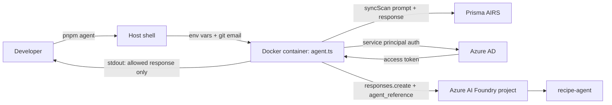
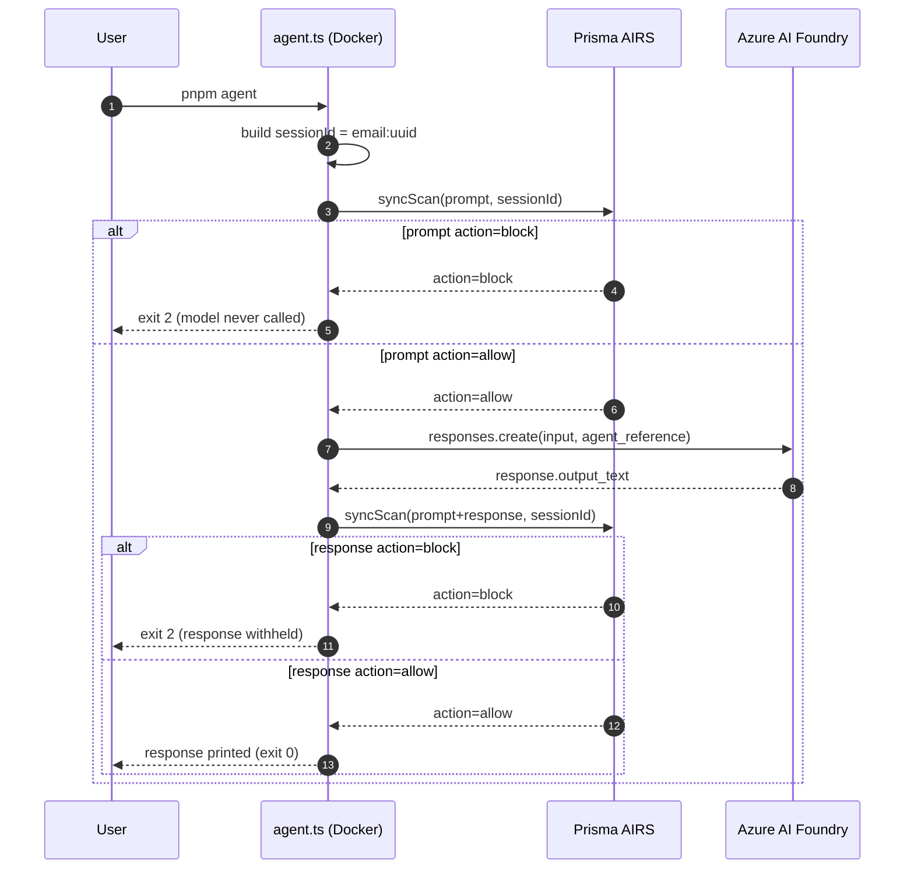

# prisma-airs-recipe-agent-azure-foundry

Reference implementation for invoking an Azure AI Foundry agent from TypeScript with Prisma AIRS scanning every prompt before it reaches the model and every response before it reaches the user. Demonstrates how to terminate malicious traffic on both legs of an LLM round-trip and how to correlate the entire run via a single AIRS `session_id`.

The shipped example uses a `recipe-agent` deployed in Azure AI Foundry, but nothing in the code is recipe-specific — point it at any Foundry agent by changing the `.env`.

## Overview

The script runs end-to-end inside a one-shot Docker container. On each invocation it:

1. Scans the user prompt against an AIRS profile. If `action=block`, the model is never called.
2. Calls the Azure AI Foundry agent via `responses.create({ input, agent_reference })`.
3. Scans the model response against the same AIRS profile. If `action=block`, the response is never shown.
4. Prints the response only when both scans return `allow`.

Every scan in a single run shares one `session_id` of the form `<git-user-email>:<uuid>`, which lets you reconstruct an entire transaction in the AIRS console from a single ID.

### Service relationships



### Request flow



## Prerequisites

- Node.js 22+ and pnpm 10+ (only required for `pnpm dev`; the Docker path needs neither inside the container)
- Docker 24+
- An Azure AI Foundry project with a deployed agent
- An Azure service principal with at least the `Azure AI User` role on the Foundry account
- A Prisma AIRS tenant with an API key and a configured profile name
- `git` configured with `user.email` (used to derive part of the AIRS `session_id`)

## Installation

```bash
git clone <this-repo>
cd prisma-airs-recipe-agent-azure-foundry
pnpm install
cp .env.example .env
# fill in the values in .env
```

To create the Azure service principal:

```bash
az login
az ad sp create-for-rbac \
  --name "prisma-airs-recipe-agent-sp" \
  --role "Azure AI User" \
  --scopes "/subscriptions/<sub-id>/resourceGroups/<rg>/providers/Microsoft.CognitiveServices/accounts/<account>"
```

Copy `appId` → `AZURE_CLIENT_ID`, `password` → `AZURE_CLIENT_SECRET`, `tenant` → `AZURE_TENANT_ID`.

## Configuration

All configuration is via environment variables. See `.env.example` for the full template.

| Variable | Required | Description |
|----------|----------|-------------|
| `AZURE_AI_ENDPOINT` | Yes | Foundry project endpoint, e.g. `https://<resource>.services.ai.azure.com/api/projects/<project>` |
| `AZURE_AI_AGENT_NAME` | Yes | Deployed agent name (e.g. `recipe-agent`) |
| `AZURE_AI_AGENT_VERSION` | Yes | Agent version pin. Use the latest known-good version; older versions may have stale instructions |
| `AZURE_TENANT_ID` | Yes | Azure AD tenant ID for the service principal |
| `AZURE_CLIENT_ID` | Yes | Service principal app ID |
| `AZURE_CLIENT_SECRET` | Yes | Service principal secret |
| `PANW_AI_SEC_API_KEY` | Yes | Prisma AIRS API key |
| `PANW_AI_SEC_API_ENDPOINT` | No | AIRS endpoint override; defaults to the SDK default |
| `PANW_AI_SEC_PROFILE_NAME` | Yes | Name of the AIRS profile to scan against |
| `AGENT_PROMPT` | No | Override the default prompt at runtime |
| `GIT_USER_EMAIL` | Auto | Injected into the container by `pnpm agent` from `git config user.email` |

## Usage

Run end-to-end in Docker (build, run, container is removed on exit):

```bash
pnpm agent
```

Override the prompt without editing the source:

```bash
AGENT_PROMPT="What's a good dough hydration for sourdough?" pnpm agent
```

Run on the host without Docker (uses your local `node` + `tsx`, loads `.env` directly):

```bash
pnpm dev
```

Expected output for an allowed round-trip:

```
AIRS session: you@example.com:b3a1c2d4-...
AIRS prompt scan: category=benign action=allow scan_id=... report_id=...
Generating response (single-turn, no conversation)...
AIRS response scan: category=benign action=allow scan_id=... report_id=...
Response output:
<the model's reply>
```

If AIRS blocks the prompt, the Azure agent is never called. If AIRS blocks the response, the model output never reaches stdout.

## Exit codes

| Code | Meaning |
|------|---------|
| `0` | Prompt and response both allowed; response printed |
| `1` | Required env var missing |
| `2` | AIRS blocked at prompt or response stage; check stderr for `scan_id` |
| `3` | AIRS SDK or network error; check stderr for `errorType` |

## Project structure

```
.
├── agent.ts          # Single-file agent + scan pipeline
├── Dockerfile        # node:22-alpine + pnpm + tsx, single-stage
├── package.json      # pnpm scripts: dev, typecheck, docker:build, docker:run, agent
├── tsconfig.json     # Strict ESM, Node 22
├── .env.example      # Template for all required env vars
├── .dockerignore
└── .gitignore
```

## How session correlation works

Each container run generates one `sessionId` of the form:

```
<git-user-email>:<uuid-v4>
```

The email is read from the host's `git config user.email` and forwarded into the container via `-e GIT_USER_EMAIL`. The UUID is generated inside the container with `crypto.randomUUID()`. Both the prompt-stage scan and the response-stage scan are submitted to AIRS with this same `sessionId`, so a single query against AIRS surfaces every scan from one execution. The same field is reserved for tool-call input and tool-call output scans if you extend the agent to use tools.
